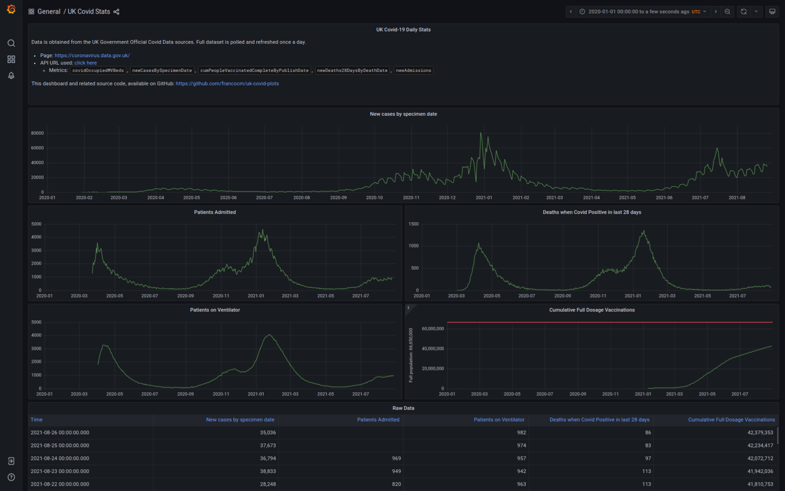

# uk-covid-plots

## About

Daily polling of [UK Government Coronavirus Data](https://coronavirus.data.gov.uk/details/download), loading into a time-series ([InfluxDB 2](https://docs.influxdata.com/influxdb/v2.0/)) database, and visualisation of such data in a [Grafana 8](https://grafana.com/) dashboard.



The Grafana dashboard is accessible without authentication, and is readonly.

The way the UK Government Coronavirus Data APIs work, is that they return the full dataset since the beginning of the pandemic. This means that running this application the first time would populate it automatically with the full data-set.

The following containers are started up when using `docker-compose up -d`:

| Name | Image | Depends on | Custom build | Purpose |
| -----| ----- | ---------- | ------------ | ------- | 
| `ukcovid-influxdb` | `influxdb:2.0-alpine` | - | No | Time-series database to store the actual data records. |
| `ukcovid-grafana` | `grafana/grafana:latest` | `influxdb` | No | Graphing and visualisation tool, reading from the InfluxDB 2 as its datasource. |
| `ukcovid-dataloader` | `alpine:latest` | `influxdb` | Yes, hence why `docker-compose build` is required as part of the setup steps below. | Provides a Python script that periodically runs and ships the fetched data to `ukcovid-influxdb`. |

## Setup

### System requirements

Any `AMD64`, `ARM64` and `ARM` architecture running [Docker](https://www.docker.com/), should support this tool.

Tested on the following setups:
* Intel Core i5 running Ubuntu 21.04 + Docker v20.10.8
* Raspberry Pi 4 running Ubuntu 20.04 + Docker v20.10.8

### Environment requirements

* [Docker](https://docs.docker.com/engine/install/)
* [Docker Compose](https://docs.docker.com/compose/install/)

### Steps

1. Clone this project: `git clone https://github.com/francocm/uk-covid-plots.git`
2. Run: `cd uk-covid-plots`
3. **Optional**: Modify parameters inside [.env](.env).
4. **Optional**: Modify any parameters inside [docker-compose.yml](docker-compose.yml).
5. Refresh the secrets from the supplied default - see [Refresh secrets](#refresh-secrets) below.
5. Run: `docker-compose build`
6. Run: `docker-compose up -d`

Then visit [http://localhost:3000/d/_u1K1DVnk/uk-covid-stats](http://localhost:3000/d/_u1K1DVnk/uk-covid-stats) _(takes you straight to the `General / UK Covid Stats` dashboard)_.

**DO NOT** delete the contents inside `data/influx/` after the first run, or you will lose all the data collected so far!

An archive of API responses in JSON format is stored under `data/archive`.

Standard `docker-compose` management commands are used to manage and monitor the running containers.

#### Refresh secrets

> **Note**: This works only when it has not yet been provisioned. If it already exists, destroy it, and re-provision freshly. The script should rebuild data from the beginning of time anyway, assuming that the UK Government keeps providing this.

Running this script will automatically generate new secrets and update all the configuration throughout to make sure configuration is properly aligned.

**Linux / Mac Shell directly**

```bash
# important, you must cd into the directory first!

cd path/to/uk-covid-plots
./secrets-refresh.sh
```

**Temporary Docker container - compatible with any OS**

```bash
# Works on Windows (Powershell only!), MacOS, and Linux

docker run --rm -v "${PWD}:/tmp/uk-covid-plots" alpine:latest /bin/sh -c "cd /tmp/uk-covid-plots && apk add uuidgen && ./secrets-refresh.sh"
```

### Configuration

The default configuration should suffice. Passwords / tokens are generated / refreshed automatically as described under [Refresh secrets](#refresh-secrets) above.

All modifiable params are under [.env](.env).

| Key | Description | Avoid changing |
| --- | ----------- | -------------- |
| `DOCKER_INFLUXDB_INIT_USERNAME` | The Influx DB username. This needs to match with the datasource configuration inside Grafana. | Avoid |
| `DOCKER_INFLUXDB_INIT_PASSWORD` | The Influx DB password. | Avoid |
| `DOCKER_INFLUXDB_INIT_ORG` | The Influx DB organisation. This needs to match with the datasource configuration inside Grafana. | Avoid |
| `DOCKER_INFLUXDB_INIT_BUCKET` | The Influx DB bucket. This needs to match with the dashboard queries. | Avoid |
| `DOCKER_INFLUXDB_INIT_RETENTION` | The Influx DB retention period. | Avoid |
| `DOCKER_INFLUXDB_INIT_MODE` | The influx DB initialisation mode. This should not be modified. | Avoid |
| `DOCKER_INFLUXDB_INIT_ADMIN_TOKEN` | The Influx DB token. This needs to match with the datasource configuration inside Grafana. | Avoid |
| `DOCKER_INFLUXDB_HOST` | The Influx DB host. This needs to point to the InfluxDB 2 container. | Avoid |
| `DATA_METRICS` | The metrics to be fetched from the UK Government API. There's a hard limit of 5 metrics - this is controlled by the UK Government systems. Changing these values would break the dashboard, and would necessitate defining a new dashboard accordingly. | Avoid |
| `DATA_URL` | The UK Government API URL from which to fetch the data. This URL should be complete, excluding the metrics keys, as they will be automatically appened based on the `DATA_METRICS` configuration field above. | Avoid |
| `FETCH_INTERVAL_MINUTES` | The poll interval to refresh data and invoke the UK Government API. It's pre-set to once a day, as there is little purpose in being more frequent that that. Unit is in minutes. | Can modify |
| `JSON_ARCHIVE_DIR` | The archive directory within the container, where to store the UK Government API responses after fetching. | Avoid |

### Backing up

Backing up the responses archive should be enough, as in theory these could be re-used to rebuild the full dataset.

To take a full backup however, both the archive and the `data/influx/` directory (i.e. the whole `data/` directory) should be backed up. Make sure you don't lose structure or permissions of individual files when doing so.

A recommended way would be:

```bash
tar czvf /path/to/backup/location/uk-covid-plots_backup-yyyymmdd.tar.gz data/
```

## Future improvements and development

* Ability to rebuild the Influx DB data using the archive files instead of performing an API call.

Feel free to share ideas in the issues section, or raise pull requests to this repository.

## Acknowledgements

* [Grafana](https://grafana.com/)
* [InfluxDB](https://www.influxdata.com/)
* [Python](https://www.python.org/)
* [Docker](https://www.docker.com/)
* [ischedule Python library](https://github.com/aleksve/ischedule)
* [UK Government Coronavirus APIs](https://coronavirus.data.gov.uk/details/download)

If you feel you should have been included in this list, kindly contact me or raise a PR with the inclusion - I apologise for any omissions, it's not intentional.

***EOF***   